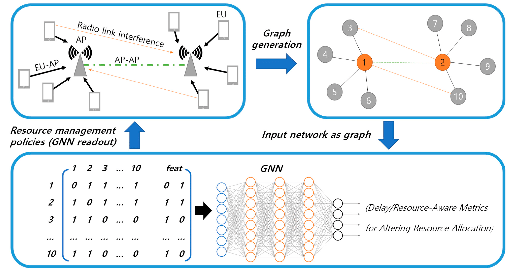

# Graph Neural Network in Wireless Communication Papers
This repository contains the list of papers that considered the application of Graph Neural Network in Wireless Communication

  
  

# Resource Allocation and Optimization

<li><a target="_blank" href="https://github.com/danieloaAAU/Power_Control_GNN" style="text-decoration:none;"> Power Control for 6G Industrial Wireless Subnetworks: A Graph Neural Network Approach </a></li>
  
<li><a target="_blank" href="https://ieeexplore.ieee.org/document/9252917" style="text-decoration:none;"> Graph Neural Networks for Scalable Radio Resource Management Architecture Design and Theoretical Analysis </a></li>

<li><a target="_blank" href="https://arxiv.org/abs/1909.01865" style="text-decoration:none;"> Optimal Wireless Resource Allocation With Random
Edge Graph Neural Networks </a></li>

<li><a target="_blank" href="https://ieeexplore.ieee.org/document/9462385" style="text-decoration:none;"> A GNN-Based Supervised Learning Framework for
Resource Allocation in Wireless IoT Networks </a></li>

<li><a target="_blank" href="https://ieeexplore.ieee.org/document/9322537" style="text-decoration:none;"> Resource Allocation based on Graph Neural
Networks in Vehicular Communications </a></li>

<li><a target="_blank" href="https://ieeexplore.ieee.org/abstract/document/9685457" style="text-decoration:none;"> Scalable Power Control/Beamforming in Heterogeneous Wireless Networks with Graph Neural Networks </a></li>

<li><a target="_blank" href="https://ieeexplore.ieee.org/abstract/document/9414098" style="text-decoration:none;"> Distributed Scheduling Using Graph Neural Networks </a></li>

<li><a target="_blank" href="https://ieeexplore.ieee.org/document/10014842" style="text-decoration:none;"> Learning Graph Convolutional Neural Networks to Predict Radio Environment Maps </a></li>

<li><a target="_blank" href="https://ieeexplore.ieee.org/abstract/document/10032291" style="text-decoration:none;"> A Graph Neural Network Learning Approach to Optimize RIS-Assisted Federated Learning </a></li>

<li><a target="_blank" href="https://www.nature.com/articles/s41598-022-25800-3" style="text-decoration:none;"> Graph neural network-based cell switching for energy optimization in ultra-dense heterogeneous networks </a></li>

<li><a target="_blank" href="https://arxiv.org/abs/2104.09027" style="text-decoration:none;"> Decentralized Inference with Graph Neural Networks in Wireless Communication Systems </a></li>

<li><a target="_blank" href="https://www.mdpi.com/2079-9292/11/20/3371" style="text-decoration:none;"> Graph Neural Networks for Intelligent Modelling in Network Management and Orchestration: A Survey on Communications </a></li>

# Receiver Design

<li><a target="_blank" href="https://ieeexplore.ieee.org/document/10012954" style="text-decoration:none;"> Autoencoding Graph Neural Networks for Scalable Transceiver Design </a></li>

<li><a target="_blank" href="https://ieeexplore.ieee.org/abstract/document/10011630" style="text-decoration:none;"> Overhead-Free Blockage Detection and Precoding Through Physics-Based Graph Neural Networks: LIDAR Data Meets Ray Tracing </a></li>

<li><a target="_blank" href="https://ieeexplore.ieee.org/document/9566598" style="text-decoration:none;"> Deep Neural Network Based Channel Estimation for Massive MIMO-OFDM Systems With Imperfect Channel State Information </a></li>

<li><a target="_blank" href="https://ieeexplore.ieee.org/document/9482384" style="text-decoration:none;"> Belief Propagation based Deep Neural Networks for MIMO Detection: DNN-BP </a></li>

<li><a target="_blank" href="https://arxiv.org/abs/2207.14742" style="text-decoration:none;"> Graph Neural Networks for Channel Decoding </a></li>

# Review Papers

<li><a target="_blank" href="https://ieeexplore.ieee.org/document/9618652" style="text-decoration:none;"> An Overview on the Application of Graph Neural Networks in Wireless Networks </a></li>

<li><a target="_blank" href="https://ieeexplore.ieee.org/document/9944643" style="text-decoration:none;"> Graph Neural Networks for Wireless Communications: From Theory to Practice </a></li>

<li><a target="_blank" href="https://arxiv.org/pdf/2203.15935.pdf" style="text-decoration:none;"> Graph Neural Networks in IoT: A Survey </a></li>

